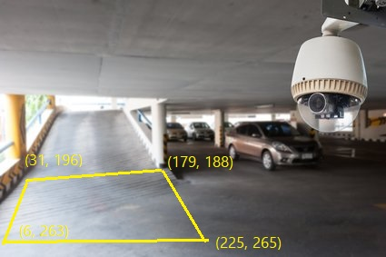
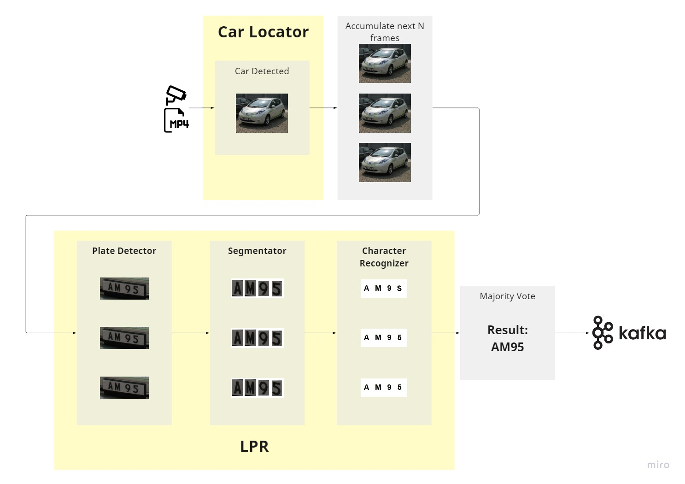

# Real Time License Plate Recognition System (LPRS)

Fast license plate recognition system on Hong Kong license plates 
with easy integration to your application.


* Note: Image for illustration purpose only. 
  This software does not draw bounding boxes or texts on your video.
  Please see [Usage](#Usage) for the output format and how to receive it.


## Features

#### Performance
- [X] 97% accuracy, highest in the market
- [X] < 1s prediction time on NVIDIA T4 GPU, 4vCPU with TensorRT

#### Capabilities
- [X] Dark environment
- [X] Blurry image
- [X] Glares
- [X] Angled image
- [X] Plates with 2 rows
- [X] Multiple vehicles

#### Integration
- [X] Local Kafka topic
- [X] IP cameras and .mp4 video files
- [X] Multiple cameras

#### Accelerations
- [X] CUDA support
- [ ] TensorRT support (work in progress)


## Background
This was an on-premise project that I did with my partners for a car park in Hong Kong in 2020. 
This software would run on a GPU machine, connect to the IP cameras at the entrance of a car park
and provide real time license plate recognition service on any vehicles entering the car park.

We decided to open source this project in 2022. I took this opportunity to tidy up the code and deployment.

## Usage

### Model Weights
First, go to [Google Drive](https://drive.google.com/drive/folders/1fNoDYwfrAReR2KT5IaQCQQDLUcS4dcKS?usp=sharing) 
to download the model weights and put them inside `./data`.

The weights are trained on a proprietary Hong Kong license plate dataset.
This repository does not contain training code of the models.
If you would like to run on other countries' license plates, 
please retrain the models on your dataset. 

### Run on Docker
As instructed by the PyTorch docker image, please set the following environment variables:
```shell
export COMPOSE_DOCKER_CLI_BUILD=1 
export DOCKER_BUILDKIT=1
```

Then, simply run 
```shell
docker-compose up -d
```

Then, run your Kafka consumer listening on `localhost:9092` to receive the messages.

### Output Format
Your Kafka consumer should receiver messages in this format:
```
{'camera': '123.0.0.1', 'license_number': 'AB1234', 'confidence': 0.99, 'time': '2022-07-27 16:21:42'}
{'camera': '123.0.0.2', 'license_number': 'CD5678', 'confidence': 0.88, 'time': '2022-07-27 16:21:42'}
```

## Configurations

### Camera Source
The current setting is configured to run on multiple video files inside `./assets/videos`.

To run on other video files or IP cameras, you would need to modify `./configs/cameras.yaml`, which looks like this:
```yaml
cameras:
  my_camera:
    type: 'entrance'
    ip: '127.0.0.1'
    fps_simulation: 30
    accum_time: 0.5
    trigger_zone:
      - !!python/tuple [531, 983]
      - !!python/tuple [1050, 700]
      - !!python/tuple [565, 565]
      - !!python/tuple [360, 750]
```

- name: you can change the name from `my_camera` to any valid string
- `type`: only `entrance` is support at the moment
- `ip`: camera source, which can take one of the following values:
  - `./path/to/video`: the path to video file
  - `127.0.0.1`: ip camera
  - `0`: web cam
- `fps_simulation`: use your video or camera fps value
- `accum_time`: maximum frame accumulation time for majority vote
- `trigger_zone` (*Optional*): This defines a polygon on the frame, inside which LPR will be performed. 
The format is a list of vertices in (x, y). The vertices need to be in order in either clockwise 
or anti-clockwise direction. The polygon is usually, but not necessary, a tetragon. 
See image below for an example. If the whole frame is valid, don't specify this field.




## How It Works

The software runs in perpetual loop, detecting for a vehicle in the trigger zone.

When a vehicle is detected, the next N frames are saved in a list. 
This is because the frame can be blurry due to vehicle motion, lighting and glare. 
To achieve high accuracy, we will perform OCR on multiple images and do majority vote on the results.

Next, each frame will undergo a sequence of 3 steps: plate detection, character segmentation 
and character recognition. As mentioned, we have a majority vote to decide the final
license plate numbers.

The result is then pushed to a local Kafka topic where it can be consumed by other process.



# Speed (T4, 4vCPU):
Car detection (trt)
Plate detection (trt)
Char segmentation (torch)
Char recognition (torch)
-----------------------------
3 videos input, num_votes=8
=> camera fps: 55
=> no lpr prediction loop: ~0.18s
=> 1 lpr prediction loop: ~0.9s
